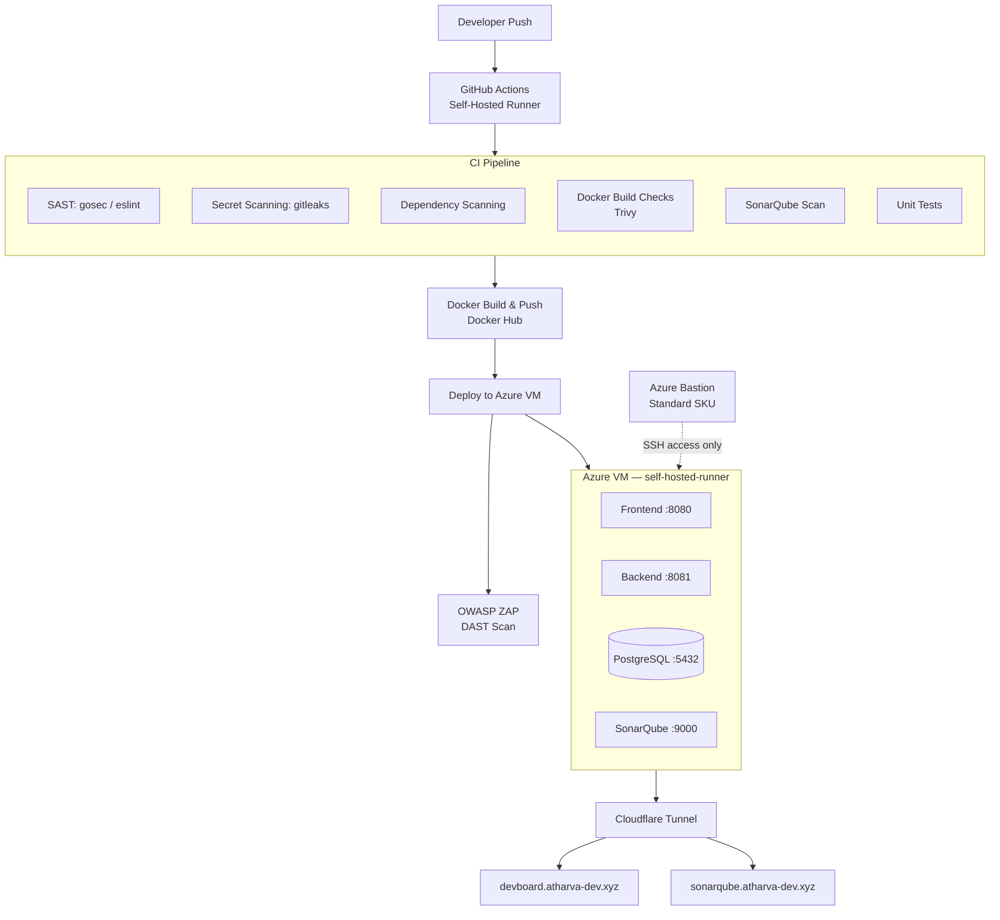
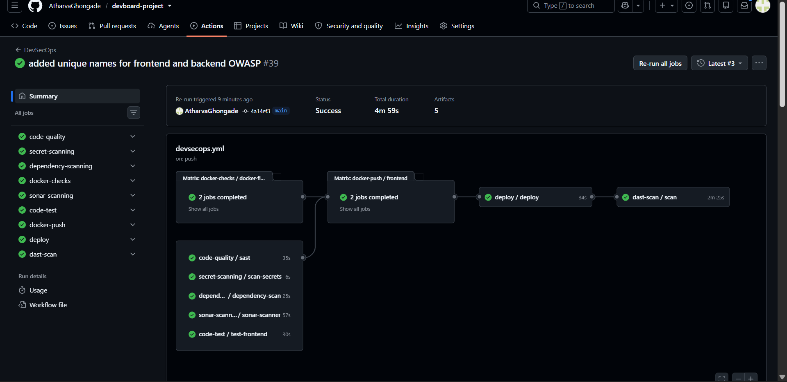
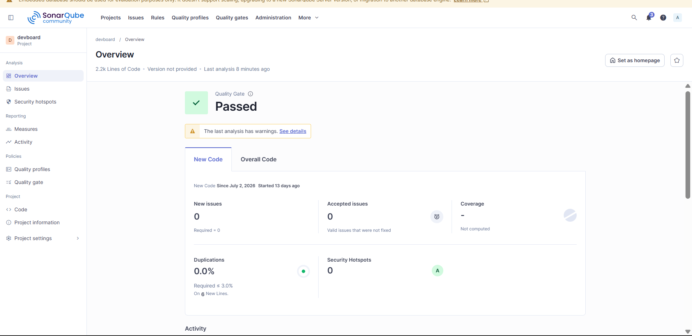
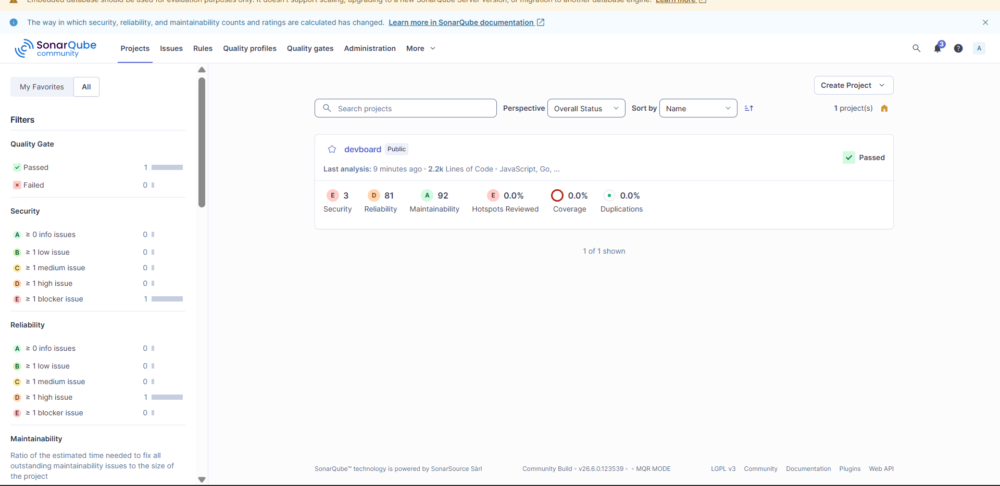
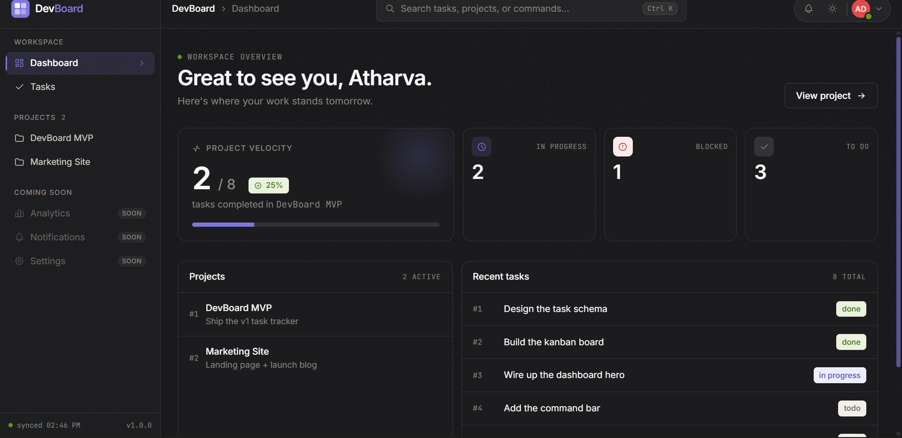
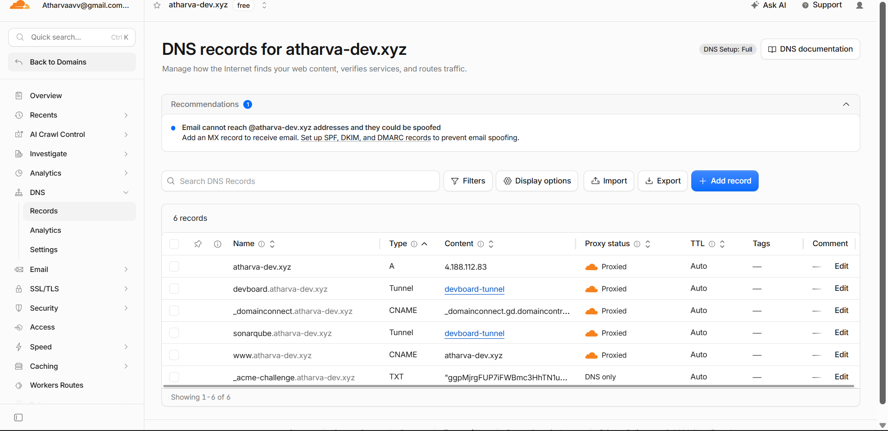

<div align="center">

# DevBoard — DevSecOps CI/CD Pipeline

**A self-hosted, security-first CI/CD pipeline built end-to-end on Azure**

[](https://github.com/AtharvaGhongade/devboard-project/actions)
[](https://devboard.atharva-dev.xyz)
[](https://sonarqube.atharva-dev.xyz)
[](LICENSE)

[Live Demo](https://devboard.atharva-dev.xyz) · [SonarQube Dashboard](https://sonarqube.atharva-dev.xyz) · [Pipeline Runs](https://github.com/AtharvaGhongade/devboard-project/actions)

</div>

---

## What this is

DevBoard is a task-tracker web app (Go backend + JS/TS frontend), but the app itself isn't the point — **the pipeline that ships it is**. This project is a hands-on implementation of a full DevSecOps workflow: every commit to `main` runs through static analysis, secret scanning, dependency scanning, container image checks, unit tests, a security-gated build, and a post-deploy dynamic scan — before landing on a production-style Azure environment reachable only through a zero-trust tunnel.

Built as a self-directed learning project after a DevOps internship, to go deeper into the "Sec" half of DevSecOps rather than just wiring together a green checkmark.

---

## Architecture



**Key design decisions:**
- **No public inbound ports on the VM.** All app traffic reaches the VM through an outbound-only Cloudflare Tunnel; admin access goes through Azure Bastion. The NSG stays locked down.
- **Self-hosted runner, not GitHub-hosted.** Gives the pipeline direct access to deploy into the private VNet without exposing deployment credentials over the public internet.
- **DAST is report-only, not a blocking gate.** OWASP ZAP runs post-deploy on every push and produces a full report, but doesn't fail the build. This was a deliberate scoping call — full DAST-as-gate needs baseline tuning and false-positive triage that's a project of its own; documented here rather than silently glossed over.

---

## Pipeline stages

| Stage | Tool | What it catches |
|---|---|---|
| `code-quality` | Static analysis (SAST) | Code smells, insecure patterns |
| `secret-scanning` | gitleaks | Committed credentials, API keys, tokens |
| `dependency-scanning` | GitHub-native | Vulnerable/outdated dependencies |
| `docker-checks` | Trivy | Container image vulnerabilities |
| `sonar-scanning` | SonarQube Community | Bugs, code smells, maintainability rating |
| `code-test` | Go test / npm test | Unit test regressions |
| `docker-push` | Docker Hub | Versioned, scanned image publish |
| `deploy` | GitHub Actions → Azure VM | Zero-touch deploy via self-hosted runner |
| `dast-scan` | OWASP ZAP baseline | Runtime vulnerabilities on the live app |

---

## Tech stack

**Infra & Cloud:** Azure VM, Azure Bastion (Standard SKU), Cloudflare Tunnel, Cloudflare DNS
**CI/CD:** GitHub Actions (self-hosted runner), Docker, Docker Hub
**Security tooling:** SonarQube Community Edition, OWASP ZAP, gitleaks, Trivy
**App stack:** Go (Gin), JavaScript/TypeScript frontend, PostgreSQL
**Observability:** Docker healthchecks, systemd service monitoring

---

## Screenshots

### CI/CD pipeline — full run, all stages passing

9 stages — code quality, secret scanning, dependency scanning, Docker checks, SonarQube scan, unit tests, Docker push, deploy, and DAST — all green in under 5 minutes.

### SonarQube — quality gate passed

Zero new issues, 0% duplication (required ≤3%), quality gate passed on every push.

### SonarQube — project-level metrics

Security, Reliability, and Maintainability ratings tracked across ~2.2k lines of code.

### Live application

The deployed app, served through Cloudflare Tunnel with no public inbound ports on the VM.

### DNS & tunnel routing

Two subdomains routed through a single Cloudflare Tunnel to different local ports on the VM.

---

## Running locally

```bash
git clone https://github.com/AtharvaGhongade/devboard-project.git
cd devboard-project
cp .env.example .env   # fill in local values
docker compose up -d
```

| Service | URL |
|---|---|
| Frontend | http://localhost:8080 |
| Backend health check | http://localhost:8081/health |
| SonarQube | http://localhost:9000 |
| Postgres | localhost:5432 |

---

## Challenges solved along the way

A few of the real debugging problems this pipeline survived (not just "it worked first try"):

- **OOM kills on the Azure VM** during SonarQube scans — root-caused to an undersized B1s VM, resolved by resizing to B2s.
- **GitHub Actions secrets not propagating** into reusable workflow calls — fixed with explicit `secrets: inherit`.
- **Azure Bastion Developer SKU blocking WSL SSH tunnels** — Native Client support requires Standard SKU; upgraded and reconfigured.
- **Cloudflare Tunnel routing two subdomains through one tunnel** — single `cloudflared` config with per-hostname ingress rules instead of separate tunnels.

---

## Author

**Atharva Ghongade** — DevOps / Cloud Engineer
[LinkedIn](https://www.linkedin.com/in/atharva-ghongade-/) · [GitHub](https://github.com/AtharvaGhongade)
